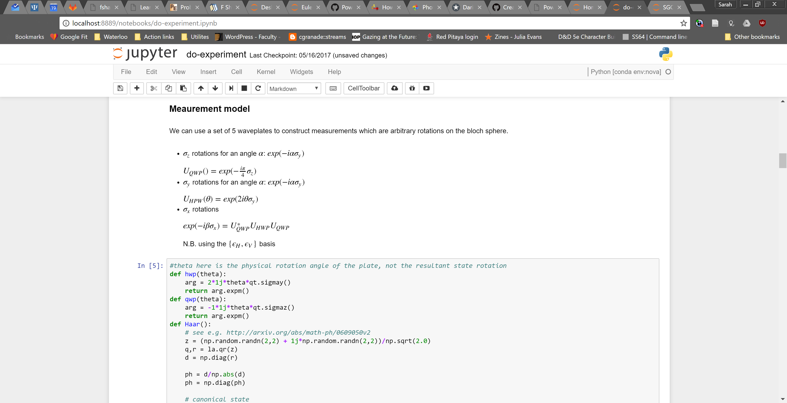
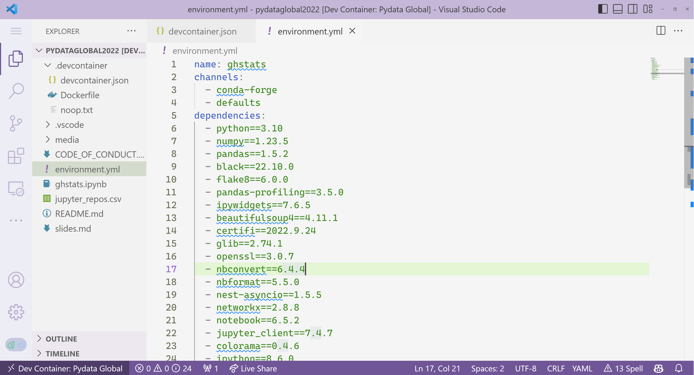
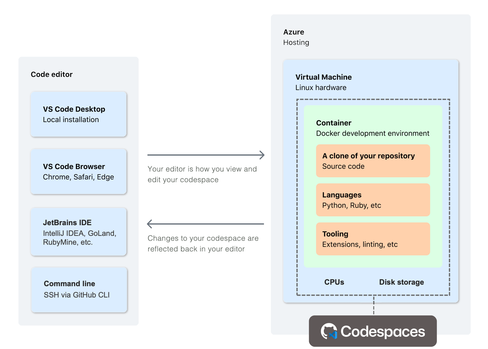

# **Level up you Jupyter Notebooks with VS Code**

PyData Global 2022

https://aka.ms/pydataglobal

---
# Hi, I'm Sarah! 👋

##### 🐍 Pythonista | 🧪 Scientist | 📚 OSS Contributor

Cloud Developer Advocate @ Microsoft

---

---
# Jupyter notebooks are fun!

---
# VS Code is is great!

---
# But what if we could combine them??

👉 the best of VS Code, now in Jupyter notebooks

---

